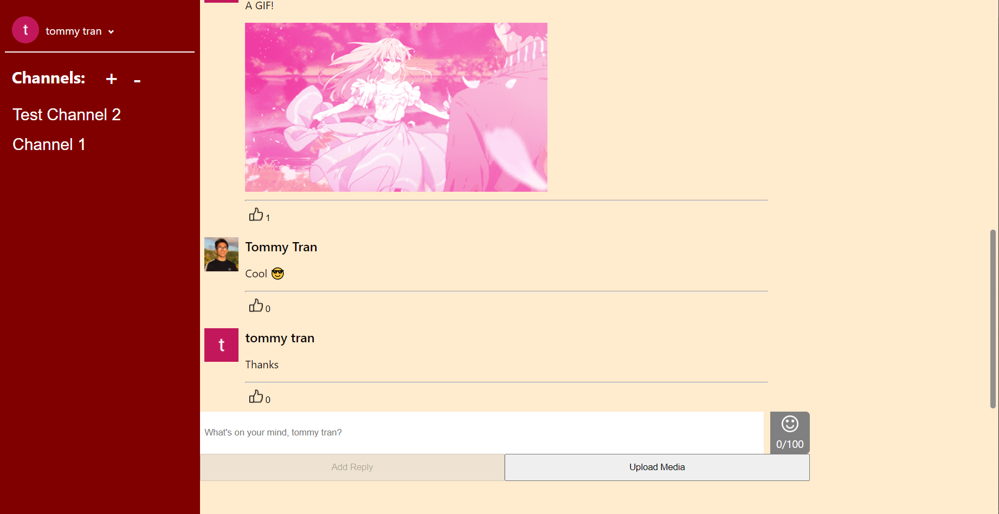
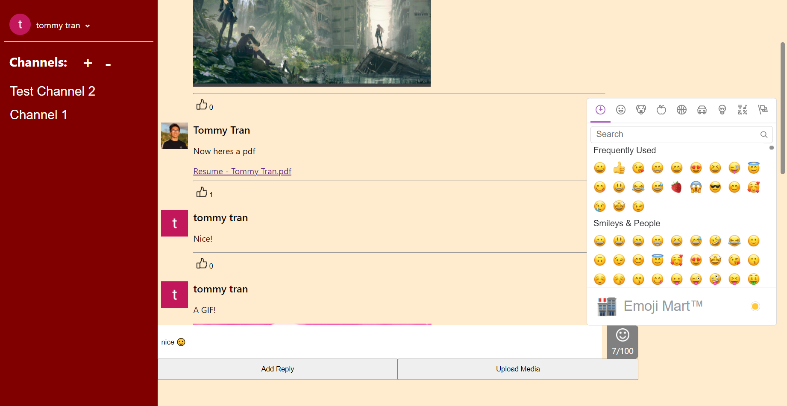
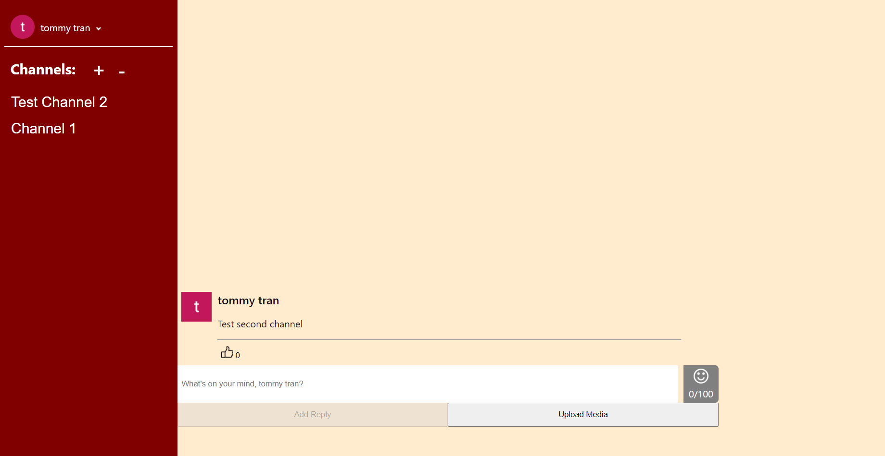
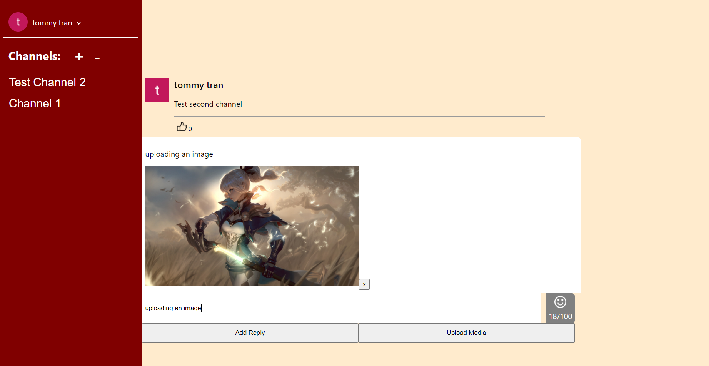

# socialmedia-app

 Create a social media web application with react/firebase. Trying to recreate a <b>slack clone</b>.
 
## Description 
 
React website using firebase as platform for development. The app is an attempt to recreate features of Slack, a social media app. Development familiarize myself with React. It also helped me learn about Firebase, how to upload/manipulate files on Firebase's storage, and how to update/manipulate user generated data on Firebase's Firestore, a cloud-hosted NoSQL database.

## FEATURES
        [x] 1. Upload Media immediately lets you choose file without using Choose File input.
        [x] 2. Delete Posts
        [x] 3. Delete images off of database when user deletes post
        [x] 4. Unique ids for each image so it doesnt affect images with same file names
        [x] 5. Create Channels
        [x] 6. UI
        [x] 7.1. Limit amount of post per user (1000) 
        [x] 7.2. Limit amount of files per user (10)
        [x] 7.3. Limit amount of channel per user (3)
        [x] 8. Load more post as you scroll up
        [x] 9. Sign In/ Sign out
        [ ] 10. create server / invite users to server
        [ ] 11. delete channels / delete servers (requires a lot of reads/updates on firestore, but since my app is using the free data limits on firestore, I cannot add this feature)
        [ ] 12. Edit post message with setting icon
        [ ] 13. Search bar
        [ ] 14. Channel info
        [ ] 15. User list (online/ offline)

## LINK

https://socialmedia-app-3.web.app/

## SAMPLE IMAGES

#### Channel 1

#### Using emojis

#### Channel 2

#### Uploading Media 

